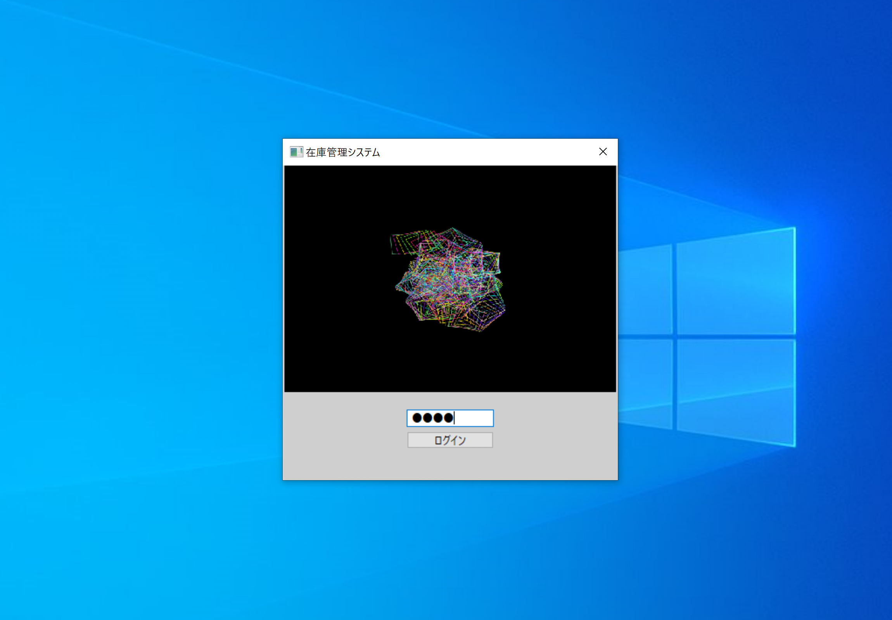

# Stock Manager App

### This softwere is compatible with Windows10.
### Development Environment: Python3.6.5 (with matplotlib,pandas,wxPython,datetime,hashlib,pickle,webbrowser,pycryptodome)
### Login Password: 1234

## How to create .exe
1.Edit setup.py to suit your environment.

2.Run setup.py.
